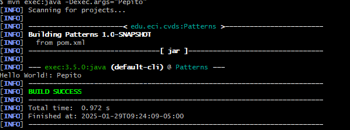

## Integrantes
ANDERSSON DAVID SÁNCHEZ MÉNDEZ

CRISTIAN SANTIAGO PEDRAZA RODRÍGUEZ

## I. LA HERRAMIENTA MAVEN
1. Cuál es su mayor utilidad

2. Fases de maven

3.  Ciclo de vida de la construcción

4. Para qué sirven los plugins

5. Qué es y para qué sirve el repositorio central de maven

# II. LA HERRAMIENTA MAVEN

### CREAR UN PROYECTO CON MAVEN

Buscar cómo se crea un proyecto maven con ayuda de los arquetipos (archetypes).

1. Verificamos la versión


2. Ahora creamos el directorio con el comando proporcionado.

Busque cómo ejecutar desde línea de comandos el objetivo "generate" del plugin "archetype", con los siguientes parámetros:

```yml
ProjectId: org.apache.maven.archetypes:maven-archetype-quickstart:1.0
Id del Grupo: edu.eci.cvds
Id del Artefacto: Patterns
Paquete: edu.eci.cvds.patterns.archetype
```

Según documentación, hay que seguir este ejemplo
```yml
mvn archetype:generate -DgroupId=com.mycompany.app -DartifactId=my-app -DarchetypeArtifactId=maven-archetype-quickstart -DarchetypeVersion=1.5 -DinteractiveMode=false
```

Haciendo que nuestro comando quede como:
```yml
mvn archetype:generate -DgroupId=edu.eci.cvds -DartifactId=Patterns -DarchetypeArtifactId=maven-archetype-quickstart -DarchetypeVersion=1.5 -DinteractiveMode=false -Dpackage=edu.eci.cvds.patterns.archetype
```


### COMPILAR Y EJECUTAR
Para compilar ejecute el comando:
```sh
$ mvn package
```

Si maven no actualiza las dependencias utilice la opción `-U` así:
```sh
$ mvn -U package
```


---

Busque cuál es el objetivo del parámetro "package" y qué otros parámetros se podrían enviar al comando `mvn`.

Busque cómo ejecutar desde línea de comandos, un proyecto maven y verifique la salida cuando se ejecuta con la clase `App.java` como parámetro en "mainClass". Tip: https://www.mojohaus.org/exec-maven-plugin/usage.html

```yml
        </plugin>
          <plugin>
        <groupId>org.codehaus.mojo</groupId>
        <artifactId>exec-maven-plugin</artifactId>
        <version>3.5.0</version>
        <executions>
          <execution>
            <goals>
              <goal>java</goal>
            </goals>
          </execution>
        </executions>
        <configuration>
          <mainClass>edu.eci.cvds.patterns.archetype.App</mainClass>
        </configuration>
      </plugin>

```
* comando para compilar
```yml
mvn package
```

* comando para ejecutar
```yml
mvn exec:java
```


Realice el cambio en la clase `App.java` para crear un saludo personalizado, basado en los parámetros de entrada a la aplicación. 


Utilizar la primera posición del parámetro que llega al método "main" para realizar elsaludo personalizado, en caso que no sea posible, se debe mantener el saludo como se encuentra actualmente:

Buscar cómo enviar parámetros al plugin "exec".


Ejecutar nuevamente la clase desde línea de comandos y verificar la salida: Hello World!

Ejecutar la clase desde línea de comandos enviando su nombre como parámetro y verificar la salida. Ej: Hello Pepito!




Ejecutar la clase con su nombre y apellido como parámetro. ¿Qué sucedió?

Verifique cómo enviar los parámetros de forma "compuesta" para que el saludo se realice con nombre y apellido.

Ejecutar nuevamente y verificar la salida en consola. Ej: Hello Pepito Perez!


