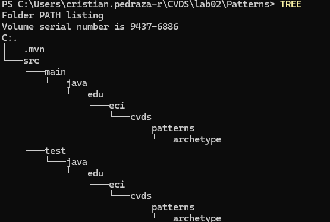

## I. LA HERRAMIENTA MAVEN
1. Cuál es su mayor utilidad

2. Fases de maven

3.  Ciclo de vida de la construcción

4. Para qué sirven los plugins

5. Qué es y para qué sirve el repositorio central de maven

# II. LA HERRAMIENTA MAVEN

### CREAR UN PROYECTO CON MAVEN

Buscar cómo se crea un proyecto maven con ayuda de los arquetipos (archetypes).

1. Verificamos la versión


2. Ahora creamos el directorio con el comando proporcionado.

Busque cómo ejecutar desde línea de comandos el objetivo "generate" del plugin "archetype", con los siguientes parámetros:

```yml
ProjectId: org.apache.maven.archetypes:maven-archetype-quickstart:1.0
Id del Grupo: edu.eci.cvds
Id del Artefacto: Patterns
Paquete: edu.eci.cvds.patterns.archetype
```

Según documentación, hay que seguir este ejemplo
```yml
mvn archetype:generate -DgroupId=com.mycompany.app -DartifactId=my-app -DarchetypeArtifactId=maven-archetype-quickstart -DarchetypeVersion=1.5 -DinteractiveMode=false
```

Haciendo que nuestro comando quede como:
```yml
mvn archetype:generate -DgroupId=edu.eci.cvds -DartifactId=Patterns -DarchetypeArtifactId=maven-archetype-quickstart -DarchetypeVersion=1.5 -DinteractiveMode=false
```
arquetipo 1.5
-Dpackage
