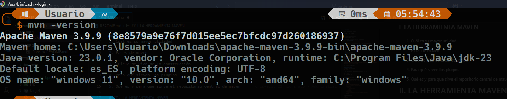
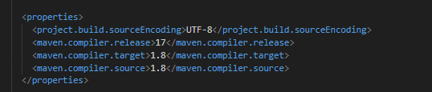
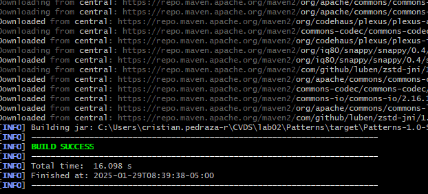
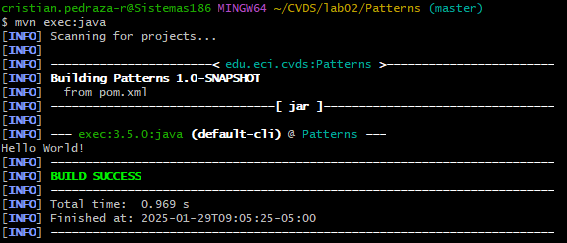
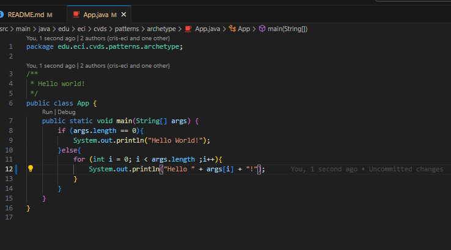
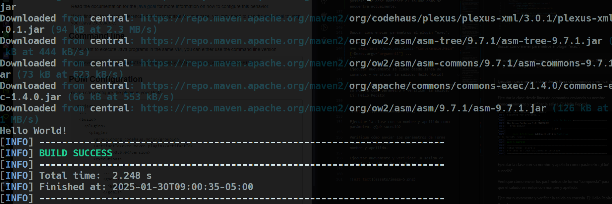
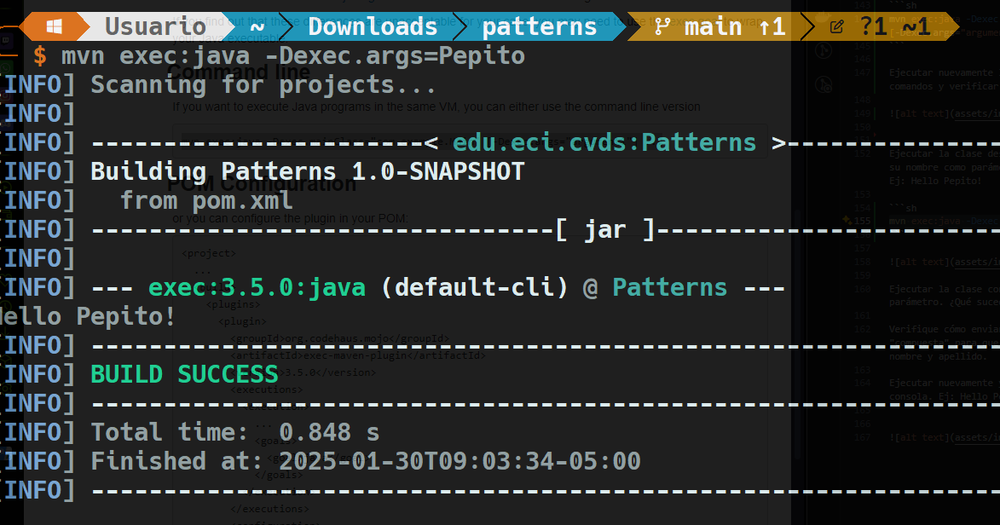
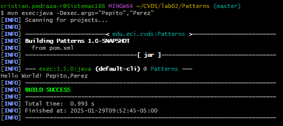

## INTEGRANTES
ANDERSSON DAVID SÁNCHEZ MÉNDEZ

CRISTIAN SANTIAGO PEDRAZA RODRÍGUEZ

## PRE-RREQUISITOS
* Java OpenJDK Runtime Environment 17.x.x

* Apache Maven: 3.9.x 

## OBJETIVOS
* Entender ¿qué es Maven?
* Usar comandos de generación de arquetipos, compilación y ejecución de un proyecto usando Maven.
* Obtener puntos adicionales por PR qué corrijan o mejoren los laboratorios.

## LA HERRAMIENTA MAVEN

La herramienta Apache Maven se usa para gestionar y manejar proyectos de software. La base de maven para un proyecto es el concepto de un modelo de objeto de proyecto (POM), Maven puede gestionar la compilación, los informes y la documentación de un proyecto a partir de este modelo, que se concreta en el archivo pom.xml.


1. **¿Cuál es su mayor utilidad?** Permitir a un dev entender el estado completo de un esfuerzo de desarrollo en el menor tiempo posible.

2. **Fases de maven** El Ciclo de Vida está construido de varias fases: *validate*(¿proyecto correcto?),*compile*(compilar proyecto), *test*(pruebas proyecto), *package*(empaquetar proyecto JAR), *verify*(revisiones calidad), *install*(instalar paquete en el repositorio local) y *deploy*(despliegue proyecto).

3.  **Ciclo de vida de la construcción** Un proyecto bien definido requiere de tres ciclos de vida: *default*(maneja el despliegue del proyecto), *clean*(maneja la limpieza del proyecto) y *site*(maneja la creación del sitio web).

4. **¿Para qué sirven los plugins?** Artefactos que proveen objetivos a Maven, cuyo principal propósito es establecer nuevas funcionalidades dentro de las fases del Ciclo de Vida

5. **¿Qué es y para qué sirve el repositorio central de maven?** Registro de software que contiene artefactos de Java, bibliotecas, y marcos. Sirve para: Herramientas de creación extraigan dependencias de la aplicación, y también, ser un ecosistema de devs de Java y JVM.


## EJERCICIO DE LAS FIGURAS

### CREAR UN PROYECTO CON MAVEN

Buscar cómo se crea un proyecto maven con ayuda de los arquetipos (archetypes).

1. Verificamos la versión



2. Ahora creamos el directorio con el comando proporcionado.

Busque cómo ejecutar desde línea de comandos el objetivo "generate" del plugin "archetype", con los siguientes parámetros:

```yml
ProjectId: org.apache.maven.archetypes:maven-archetype-quickstart:1.0
Id del Grupo: edu.eci.cvds
Id del Artefacto: Patterns
Paquete: edu.eci.cvds.patterns.archetype
```

Según documentación, hay que seguir este ejemplo
```sh
mvn archetype:generate -DgroupId=com.mycompany.app -DartifactId=my-app -DarchetypeArtifactId=maven-archetype-quickstart -DarchetypeVersion=1.5 -DinteractiveMode=false
```

Haciendo que nuestro comando quede como:
```sh
mvn archetype:generate -DgroupId=edu.eci.cvds -DartifactId=Patterns -DarchetypeArtifactId=maven-archetype-quickstart -DarchetypeVersion=1.5 -DinteractiveMode=false -Dpackage=edu.eci.cvds.patterns.archetype
```


---
## AJUSTAR ALGUNAS CONFIGURACIONES EN EL PROYECTO

Editar archivo pom.xml y agregar la seccción properties antes de la sección de dependencias.

```xml
<properties>
  <maven.compiler.target>1.8</maven.compiler.target>
  <maven.compiler.source>1.8</maven.compiler.source>
</properties>
```




---
## COMPILAR Y EJECUTAR
Para compilar ejecute el comando:
```sh
$ mvn package
```

Si maven no actualiza las dependencias utilice la opción `-U` así:
```sh
$ mvn -U package
```




Busque cuál es el objetivo del parámetro "package" y qué otros parámetros se podrían enviar al comando `mvn`.
* Sirve para empaquetar un proyecto, creando un ejecutable .jar por defecto.
* `-U`: Permite actualizar dependencias.
* `content-package` y `mvn content-package:build`: Permiten ejecutar objetivos desde la línea de comandos.


Busque cómo ejecutar desde línea de comandos, un proyecto maven y verifique la salida cuando se ejecuta con la clase `App.java` como parámetro en "mainClass". Tip: https://www.mojohaus.org/exec-maven-plugin/usage.html

*Es necesario agregar al pom.xml esta nueva estructura para establecer la mainClass del proyecto y ejecutar después el mismo.*

```xml
        </plugin>
          <plugin>
        <groupId>org.codehaus.mojo</groupId>
        <artifactId>exec-maven-plugin</artifactId>
        <version>3.5.0</version>
        <executions>
          <execution>
            <goals>
              <goal>java</goal>
            </goals>
          </execution>
        </executions>
        <configuration>
          <mainClass>edu.eci.cvds.patterns.archetype.App</mainClass>
        </configuration>
      </plugin>

```


* Comando para ejecutar
```sh
mvn exec:java
```



Realice el cambio en la clase `App.java` para crear un saludo personalizado, basado en los parámetros de entrada a la aplicación. 
 
Para ello, se utiliza la primera posición del parámetro que llega al método "main" para realizar el saludo personalizado, en caso que no sea posible, se debe mantener el saludo como se encuentra actualmente.




Buscar cómo enviar parámetros al plugin "exec".

```sh
mvn exec:java -Dexec.mainClass="com.example.Main" [-Dexec.args="argument1"] ...
```

Ejecutar nuevamente la clase desde línea de comandos y verificar la salida: Hello World!




Ejecutar la clase desde línea de comandos enviando su nombre como parámetro y verificar la salida. Ej: Hello Pepito!

```sh
mvn exec:java -Dexec.args=Pepito 
```




Ejecutar la clase con su nombre y apellido como parámetro. ¿Qué sucedió?

Verifique cómo enviar los parámetros de forma "compuesta" para que el saludo se realice con nombre y apellido.

Ejecutar nuevamente y verificar la salida en consola. Ej: Hello Pepito Perez!

```sh
mvn exec:java -Dexec.args=Andersson Sánchez 
```

Solo es necesario poner con un espacio los argumentos que se desean, en este caso, solo el nombre y el apellido. Se muestra correctamente el saludo personalizado.




---
## HACER EL ESQUELETO DE LA APLICACIÓN

Cree el paquete **edu.eci.cvds.patterns.shapes** y el paquete **edu.eci.cvds.patterns.shapes.concrete**

