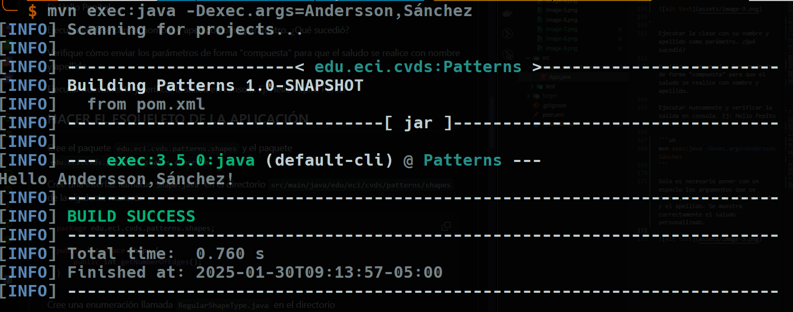
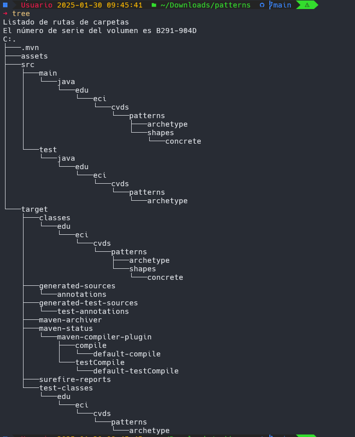

## INTEGRANTES
ANDERSSON DAVID SÁNCHEZ MÉNDEZ

CRISTIAN SANTIAGO PEDRAZA RODRÍGUEZ

## PRE-RREQUISITOS
* Java OpenJDK Runtime Environment 17.x.x

* Apache Maven: 3.9.x 

## OBJETIVOS
* Entender ¿qué es Maven?
* Usar comandos de generación de arquetipos, compilación y ejecución de un proyecto usando Maven.
* Obtener puntos adicionales por PR qué corrijan o mejoren los laboratorios.

## LA HERRAMIENTA MAVEN

La herramienta Apache Maven se usa para gestionar y manejar proyectos de software. La base de maven para un proyecto es el concepto de un modelo de objeto de proyecto (POM), Maven puede gestionar la compilación, los informes y la documentación de un proyecto a partir de este modelo, que se concreta en el archivo pom.xml.


1. **¿Cuál es su mayor utilidad?** Permitir a un dev entender el estado completo de un esfuerzo de desarrollo en el menor tiempo posible.

2. **Fases de maven** El Ciclo de Vida está construido de varias fases: *validate*(¿proyecto correcto?),*compile*(compilar proyecto), *test*(pruebas proyecto), *package*(empaquetar proyecto JAR), *verify*(revisiones calidad), *install*(instalar paquete en el repositorio local) y *deploy*(despliegue proyecto).

3.  **Ciclo de vida de la construcción** Un proyecto bien definido requiere de tres ciclos de vida: *default*(maneja el despliegue del proyecto), *clean*(maneja la limpieza del proyecto) y *site*(maneja la creación del sitio web).

4. **¿Para qué sirven los plugins?** Artefactos que proveen objetivos a Maven, cuyo principal propósito es establecer nuevas funcionalidades dentro de las fases del Ciclo de Vida

5. **¿Qué es y para qué sirve el repositorio central de maven?** Registro de software que contiene artefactos de Java, bibliotecas, y marcos. Sirve para: Herramientas de creación extraigan dependencias de la aplicación, y también, ser un ecosistema de devs de Java y JVM.


## EJERCICIO DE LAS FIGURAS

### CREAR UN PROYECTO CON MAVEN

Buscar cómo se crea un proyecto maven con ayuda de los arquetipos (archetypes).

1. Verificamos la versión


2. Ahora creamos el directorio con el comando proporcionado.

Busque cómo ejecutar desde línea de comandos el objetivo "generate" del plugin "archetype", con los siguientes parámetros:

```yml
ProjectId: org.apache.maven.archetypes:maven-archetype-quickstart:1.0
Id del Grupo: edu.eci.cvds
Id del Artefacto: Patterns
Paquete: edu.eci.cvds.patterns.archetype
```

Según documentación, hay que seguir este ejemplo
```sh
mvn archetype:generate -DgroupId=com.mycompany.app -DartifactId=my-app -DarchetypeArtifactId=maven-archetype-quickstart -DarchetypeVersion=1.5 -DinteractiveMode=false
```

Haciendo que nuestro comando quede como:
```sh
mvn archetype:generate -DgroupId=edu.eci.cvds -DartifactId=Patterns -DarchetypeArtifactId=maven-archetype-quickstart -DarchetypeVersion=1.5 -DinteractiveMode=false -Dpackage=edu.eci.cvds.patterns.archetype
```


---
## AJUSTAR ALGUNAS CONFIGURACIONES EN EL PROYECTO

Editar archivo pom.xml y agregar la seccción properties antes de la sección de dependencias.

```xml
<properties>
  <maven.compiler.target>1.8</maven.compiler.target>
  <maven.compiler.source>1.8</maven.compiler.source>
</properties>
```


---
## COMPILAR Y EJECUTAR
Para compilar ejecute el comando:
```sh
$ mvn package
```

Si maven no actualiza las dependencias utilice la opción `-U` así:
```sh
$ mvn -U package
```


Busque cuál es el objetivo del parámetro "package" y qué otros parámetros se podrían enviar al comando `mvn`.
* Sirve para empaquetar un proyecto, creando un ejecutable .jar por defecto.
* `-U`: Permite actualizar dependencias.
* `content-package` y `mvn content-package:build`: Permiten ejecutar objetivos desde la línea de comandos.


Busque cómo ejecutar desde línea de comandos, un proyecto maven y verifique la salida cuando se ejecuta con la clase `App.java` como parámetro en "mainClass". Tip: https://www.mojohaus.org/exec-maven-plugin/usage.html

*Es necesario agregar al pom.xml esta nueva estructura para establecer la mainClass del proyecto y ejecutar después el mismo.*

```xml
        </plugin>
          <plugin>
        <groupId>org.codehaus.mojo</groupId>
        <artifactId>exec-maven-plugin</artifactId>
        <version>3.5.0</version>
        <executions>
          <execution>
            <goals>
              <goal>java</goal>
            </goals>
          </execution>
        </executions>
        <configuration>
          <mainClass>edu.eci.cvds.patterns.archetype.App</mainClass>
        </configuration>
      </plugin>

```


* Comando para ejecutar
```sh
mvn exec:java
```


Realice el cambio en la clase `App.java` para crear un saludo personalizado, basado en los parámetros de entrada a la aplicación. 
 
Para ello, se utiliza la primera posición del parámetro que llega al método "main" para realizar el saludo personalizado, en caso que no sea posible, se debe mantener el saludo como se encuentra actualmente.


Buscar cómo enviar parámetros al plugin "exec".

```sh
mvn exec:java -Dexec.mainClass="com.example.Main" [-Dexec.args="argument1"] ...
```

Ejecutar nuevamente la clase desde línea de comandos y verificar la salida: Hello World!


Ejecutar la clase desde línea de comandos enviando su nombre como parámetro y verificar la salida. Ej: Hello Pepito!

```sh
mvn exec:java -Dexec.args=Pepito 
```


Ejecutar la clase con su nombre y apellido como parámetro. ¿Qué sucedió?

Verifique cómo enviar los parámetros de forma "compuesta" para que el saludo se realice con nombre y apellido.

Ejecutar nuevamente y verificar la salida en consola. Ej: Hello Pepito Perez!

```sh
mvn exec:java -Dexec.args=Andersson Sánchez 
```

Solo es necesario poner con un espacio los argumentos que se desean, en este caso, solo el nombre y el apellido. Se muestra correctamente el saludo personalizado.




---
## HACER EL ESQUELETO DE LA APLICACIÓN

Cree el paquete `edu.eci.cvds.patterns.shapes` y el paquete `edu.eci.cvds.patterns.shapes.concrete`


Cree una interfaz llamada `Shape.java` en el directorio `src/main/java/edu/eci/cvds/patterns/shapes` de la siguiente manera:

```java
package edu.eci.cvds.patterns.shapes;

public interface Shape {
    public int getNumberOfEdges();
}
```

Cree una enumeración llamada `RegularShapeType.java` en el directorio `src/main/java/edu/eci/cvds/patterns/shapes` así:

```java
package edu.eci.cvds.patterns.shapes;

public enum RegularShapeType {
    Triangle, Quadrilateral, Pentagon, Hexagon
}
```

En el directorio `src/main/java/edu/eci/cvds/patterns/shapes/concrete` cree las diferentes clases (Triangle, Quadrilateral, Pentagon, Hexagon), que implementen la interfaz creada y retornen el número correspondiente de vértices que tiene la figura.

**TRIANGLE**
```java
package edu.eci.cvds.patterns.shapes.concrete;

import edu.eci.cvds.patterns.shapes.Shape;

public class Triangle implements Shape {
    public int getNumberOfEdges() {
        return 3;
    }
}
```

**QUADRILATERAL**
```java
package edu.eci.cvds.patterns.shapes.concrete;

import edu.eci.cvds.patterns.shapes.Shape;

public class Quadrilateral implements Shape {
    public int getNumberOfEdges() {
        return 4;
    }
}
```

**PENTAGON**
```java
package edu.eci.cvds.patterns.shapes.concrete;

import edu.eci.cvds.patterns.shapes.Shape;

public class Pentagon implements Shape {
    public int getNumberOfEdges() {
        return 5;
    }
}
```


**HEXAGON**
```java
package edu.eci.cvds.patterns.shapes.concrete;

import edu.eci.cvds.patterns.shapes.Shape;

public class Hexagon implements Shape {
    public int getNumberOfEdges() {
        return 6;
    }
}
```

Cree el archivo `ShapeMain.java` en el directorio `src/main/java/edu/eci/cvds/patterns/shapes` con el método main:

```java
package edu.eci.cvds.patterns.shapes;

public class ShapeMain {

  public static void main(String[] args) {
    if (args == null || args.length != 1) {
      System.err.println("Parameter of type RegularShapeType is required.");
      return;
    }
    try {
      RegularShapeType type = RegularShapeType.valueOf(args[0]);
      Shape shape = ShapeFactory.create(type);
      System.out.println(
        String.format(
          "Successfully created a %s with %s sides.",
          type,
          shape.getNumberOfEdges()
        )
      );
    } catch (IllegalArgumentException ex) {
      System.err.println(
        "Parameter '" + args[0] + "' is not a valid RegularShapeType"
      );
      return;
    }
  }
}
```

Cree el archivo ShapeFactory.java en el directorio `src/main/java/edu/eci/cvds/patterns/shapes` implementando el patrón fábrica (Hint: https://refactoring.guru/design-patterns/catalog), haciendo uso de la instrucción switch-case de Java y usando las enumeraciones.


```java
package edu.eci.cvds.patterns.shapes;
import edu.eci.cvds.patterns.shapes.concrete.*;

public class ShapeFactory {

    public static Shape create(RegularShapeType type) {
        switch (type) {
            case Triangle:
                return new Triangle();
            case Quadrilateral:
                return new Quadrilateral();
            case Pentagon:
                return new Pentagon();
            case Hexagon:
                return new Hexagon();
            default:
                return null;
        }
    }
}

```

Después de seguir todos los pasos, el proyecto queda con esta estructura.




## ¿Cuál fábrica hiciste? 


La fábrica que implementamos fue la <b>Simple Factory</b>. 

- Simple Factory:


```java
package edu.eci.cvds.patterns.shapes;
import edu.eci.cvds.patterns.shapes.concrete.*;

public class ShapeFactory {

    public static Shape create(RegularShapeType type) {
        switch (type) {
            case Triangle:
                return new Triangle();
            case Quadrilateral:
                return new Quadrilateral();
            case Pentagon:
                return new Pentagon();
            case Hexagon:
                return new Hexagon();
            default:
                return "null";
        }
    }
}
```

Esto se debe a que se creó un enumerable que nos permite definir los tipos de figuras a utilizar. Es decir, no van a ser añadidas más figuras dinámicamente. Esto es crucial dado que con el <b>switch-case</b> podemos definir que objeto shape vamos a instanciar. 

Así, tenemos:
* Una única clase <b>ShapeFactory</b> responsable de crear todos los objetos.
* Usamos un parámetro <i>enum RegularShapeType</i> para determinar qué objeto concreto se instancia.
* No hay jerarquía de fábricas ni subclases involucradas en la creación.

## ¿Cuál es mejor?
La mejor fábrica depende de las necesidades del problema a resolver. Dado que estos patrones de diseños son diseñados para responder y resolver problemas que son cotidianos en el día a día de la arquitectura y desarrollo de software. Ahora, para este caso, consideramos que simple factory es la mejor opción porque:
1. Solo necesitamos crear instancias de formas genéricas previamente definidas en el enum que no mutarán de forma dinámica. 
2. Se centraliza la lógica de creación en el método <b>create</b> en <b>ShapeFactory</b>, dado que esta encapsula el como se instancia las formas.  Evitando la duplicación de código. 
3. Dado el uso del <b>enum</b> como parámetro, el <b>RegularShapeType</b> garantiza que solo se pasen valores válidos a la fábrica. Y, además, los elementos del enum se usan de forma eficiente en el <b>switch-case</b> de la Simple factory.
4. Dado los requerimientos del laboratorio, las formas geométricas serán fijas y no serán añadidas de forma dinámica, así, Simple Factory es suficiente.

###  Ejecute múltiples veces la clase ShapeMain, usando el plugin exec de maven con los siguientes parámetros y verifique la salida en consola para cada una:
Configuramos la nueva MainClass.
```xml
        <configuration>          
          <mainClass>edu.eci.cvds.patterns.shapes.ShapeMain</mainClass>          
        </configuration>
```

- Sin parámetros

- Parámetro: qwerty

- Parámetro: pentagon

- Parámetro: Hexagon


### ¿Cuál(es) de las anteriores instrucciones se ejecutan y funcionan correctamente y por qué?

De las anteriores instrucciones, la única que se ejecuta y crea correctamente una figura es la última instrucción. <b><i>Parámetro: Hexagon</i></b>
```bash
mvn exec:java -Dexec.args=Hexagon
```
Esto se debe a que de todas las anteriores instrucciones, esta es la única cadena de caracteres que si concuerda con uno de los valores predefinidos en el enum RegularShapeType. Si bien, también está definido Pentagon, la instrucción que se nos dió no tenía la primera letra capitalizada, siendo esta
```text
pentagon
```
y la correcta, que está en el RegularShapeType es
```text
Pentagon
```

Las demás, así mismo, tampoco estaban definidas dentro del enum. 


## ¿Para qué sirve gitignore?
Un archivo .gitignore en el directorio raíz del repositorio sirve para indicarle a Git qué archivos y directorios ignorar cuando se realiza una confirmación, es decir, cuando se hace 
`git add .`, y se van a subir los archivos al repositorio central, entonces ignora la carpeta (en este caso, 
`target`) cuando se hace push.


